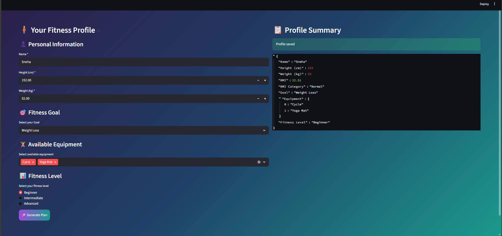
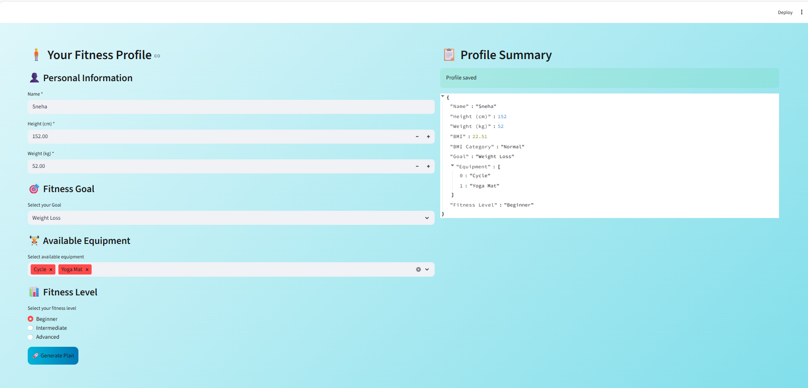

# FitPlan AI - Milestone 1: Front-End Development

## 🎯 Objective
Build the foundational web application interface for collecting user fitness details and implementing BMI calculation logic before integrating the AI model.

## 📊 BMI Formula
BMI = weight (kg) / (height in meters)²

**Categories:**
- Underweight: < 18.5
- Normal: 18.5 - 24.9
- Overweight: 25 - 29.9
- Obese: ≥ 30

## 🛠️ Steps Performed

### 1. Form Creation
- Created user-friendly fitness profile form with:
  - Personal Information (Name, Height, Weight)
  - Fitness Goal dropdown
  - Equipment multi-select
  - Fitness Level radio buttons

### 2. Input Validation
- Required field validation (no empty fields)
- No zero/negative values for height and weight
- Error messages for invalid inputs

### 3. BMI Calculation Logic
- Convert height from cm to meters
- Calculate BMI using the formula
- Round to 2 decimal places
- Classify into categories

### 4. Deployment
- Deployed on Hugging Face Spaces
- Publicly accessible web app
- Responsive design with dark/light mode

## 💻 Technologies Used
- **Streamlit**: Python web framework
- **Hugging Face Spaces**: Deployment platform
- **Git/GitHub**: Version control
- **CSS**: Custom styling with dark/light themes

## 🌐 Live Demo
[View on Hugging Face Spaces](https://huggingface.co/spaces/Snehagkudur-01/FitnessPlan)

## 📸 Screenshots

*User-friendly fitness profile form*

*User-friendly fitness profile form*

## ✅ Features Implemented
- [x] Personal information collection
- [x] Fitness details collection  
- [x] BMI calculation
- [x] BMI categorization
- [x] Input validation
- [x] Dark/Light mode support

- [x] Profile summary display

