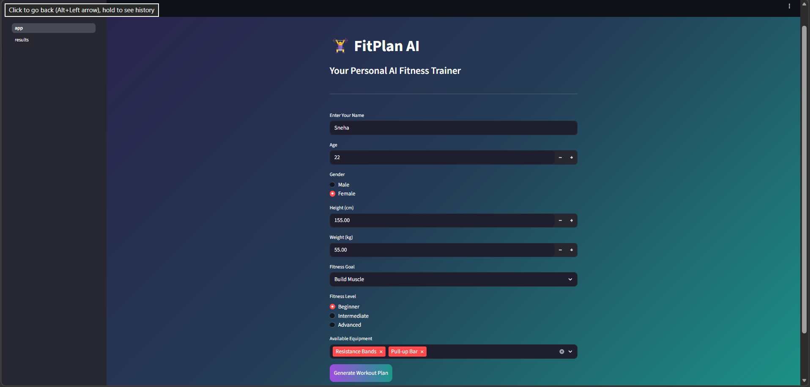
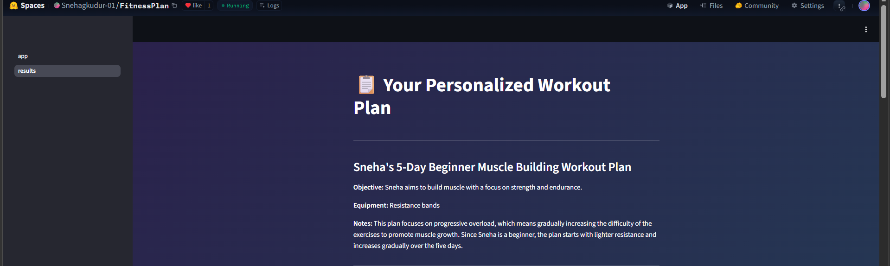
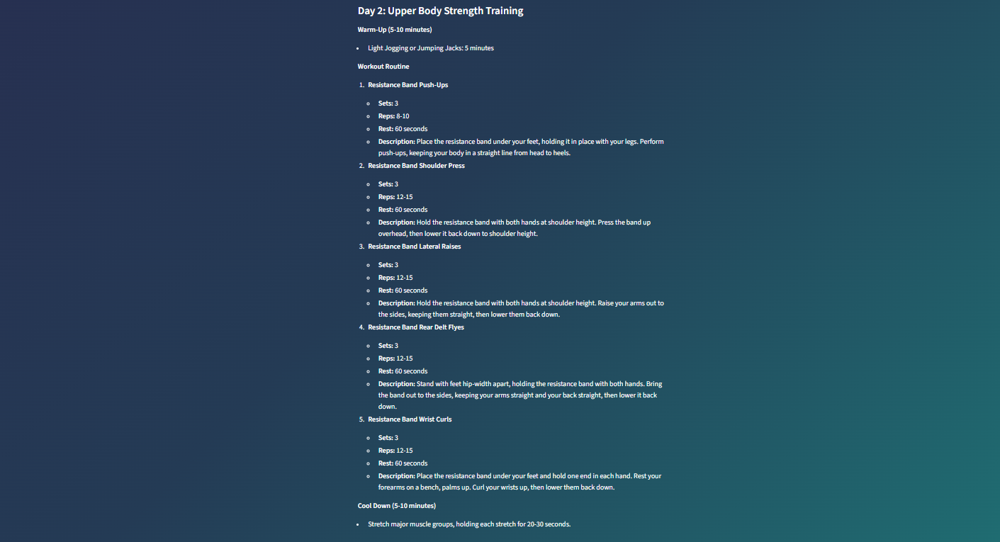

# FitPlan AI - Milestone 2: Core AI Model Integration

## 🎯 Objective
Integrate a pre-trained Large Language Model (LLM) into the FitPlan AI application to dynamically generate structured and personalized 5-day workout plans based on user fitness details collected in Milestone 1.

---

## 🤖 Model Integrated

- **Model Name:** mistralai/Mistral-7B-Instruct-v0.2  
- **Platform:** Hugging Face  
- **Integration Method:** InferenceClient API  
- **Authentication:** Secure API token (HF_TOKEN)

The model generates customized workout plans using structured prompts.

---

## 🧠 Prompt Design

The prompt is dynamically created using:

- Name  
- Age  
- Gender  
- Height & Weight  
- BMI and BMI Category  
- Fitness Goal  
- Fitness Level  
- Available Equipment  

The model is instructed to:
- Generate a 5-day workout plan
- Follow strict markdown structure
- Adjust intensity based on BMI category and fitness level
- Maintain consistent formatting for clean UI display

---

## 🛠️ Steps Performed

### 1. Model Integration
- Configured Hugging Face InferenceClient
- Loaded Mistral-7B-Instruct-v0.2 model
- Set generation parameters (max tokens, temperature)
- Implemented error handling for inference issues

### 2. Modular Prompt Creation
- Created `prompt_builder.py`
- Integrated BMI calculation logic
- Dynamically structured the prompt
- Ensured controlled markdown formatting

### 3. AI Inference
- Sent structured prompts to the model
- Generated personalized workout plans
- Displayed formatted output in Streamlit

### 4. Multi-Page UI Implementation
- Home Page: User input form
- Results Page: Generated workout plan
- Used session state for data transfer
- Maintained dark/light theme styling

### 5. Deployment
- Updated Docker-based Hugging Face Space
- Configured environment variables securely
- Successfully deployed and tested the LLM-powered app

---

## 💻 Technologies Used
- **Streamlit**: Web application framework  
- **Hugging Face InferenceClient**: Model integration  
- **Mistral-7B-Instruct-v0.2**: Large Language Model  
- **Docker**: Deployment container  
- **Git/GitHub**: Version control  
- **CSS**: Custom styling with dark/light themes  

---

## 🌐 Live Demo
[View on Hugging Face Spaces](https://huggingface.co/spaces/Snehagkudur-01/FitnessPlan/tree/main)

---

## 📸 Screenshots
  
*User fitness input interface*

  
*AI-generated structured 5-day workout plan*
  
 
 
   
   

---

## ✅ Features Implemented
- [x] LLM integration with Hugging Face  
- [x] Structured dynamic prompt generation  
- [x] Personalized 5-day workout plan generation  
- [x] BMI-based intensity adjustment  
- [x] Error handling for inference  
- [x] Multi-page Streamlit interface  

- [x] Docker deployment on Hugging Face Spaces  
